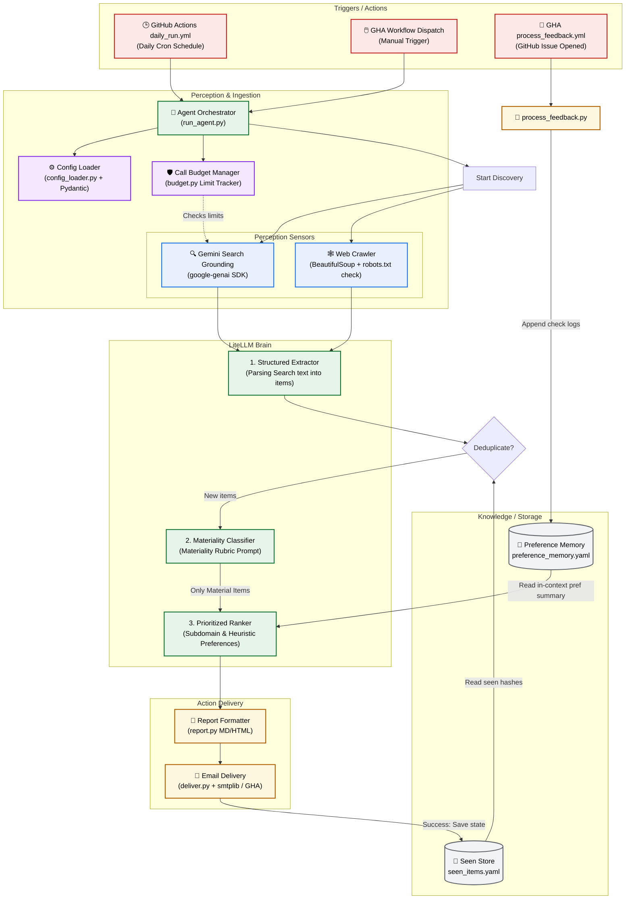

# System Architecture Diagram - `pm-competitive-intel-agent`

This document details the system design, components, and task flow of the Competitive Intelligence Monitoring Agent.

---

## 1. System Flowchart

The following diagram outlines the sequential flow of the agent, highlighting where safety guardrails, state stores, perception sensors, and cognitive LLM operations interact:

---

## 2. Component Reference Guide

This project implements the industry-standard **Autonomous AI Agent Architecture** divided into four clean boundaries:

### A. Perception Layer (Sensors)
*   **Google Search Grounding:** Queries the live web directly using Gemini's search capabilities to discover news, partnerships, and product launches within a timezone-bounded calendar window.
*   **Web Crawler:** Safely crawls custom source links by checking `robots.txt` permissions and extracting clean paragraph blocks, ensuring copyright compliance.

### B. Cognitive Engine (The Brain)
*   **Model Agnostic Abstractor:** decodes messages using `litellm`. Swap models in `config.yaml` without changing logic.
*   **Structured Parsing Agent:** extracts JSON lists of individual competitor items from raw unstructured search grounding blocks.
*   **Materiality Filter:** evaluates updates against a verbatim business rubric, suppressing noise (such as general thought-leadership or bugfixes) at a strict, deterministic temperature of `0.0`.
*   **Preference-Weighted Ranker:** summarizes user likes and dislikes as in-context prompt parameters to prioritize and sort updates, promoting the `focus_subdomain` matches to the top.

### C. Safety Guardrails (Control Systems)
*   **Pydantic Config Validator:** fails fast on start if `config.yaml` values are invalid.
*   **Search Budget Tracker:** stops making web searches if the `max_search_calls` safety cap is breached to prevent API runaway bills.
*   **Cold-Start Bounding:** caps lookbacks to 48 hours when the run state is empty to prevent fetching massive historical search results.
*   **State-Commit Sequence:** writes to `seen_items.yaml` only after confirmed email delivery to avoid silently dropping updates on delivery failure.

### D. Action Layer (Actuators)
*   **Seen Store & Preference Memory:** lightweight YAML state files committed back to git by the cron workflow.
*   **Report Generator:** formats primary featured updates and folds overflow items into a collapsed section to avoid information fatigue.
*   **GitHub Feedback Loop:** process issue titles (`feedback:{item_id}:useful`) opened by the user, updates memory, and automatically closes the issue.
